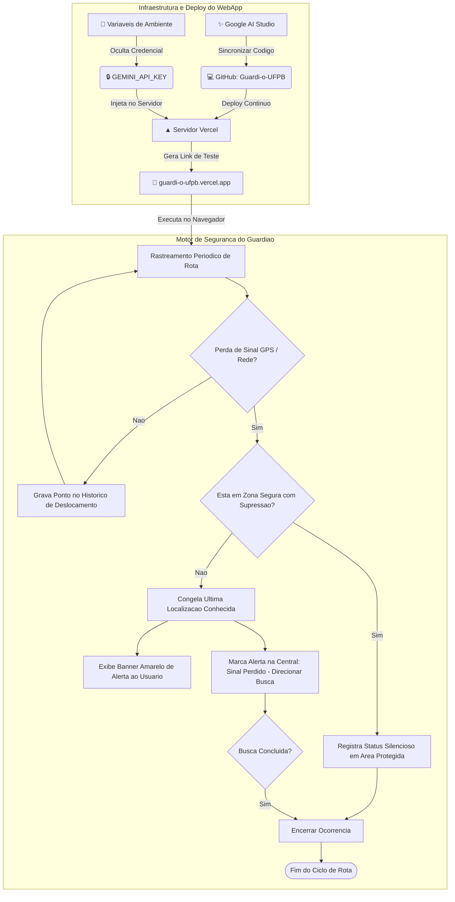

## 🛡️ Guardião UFPB

https://uniguardvercelapp.vercel.app/

O **Guardião UFPB** é um projeto em desenvolvimento com o objetivo de contribuir para a segurança de estudantes e servidores dentro do campus da Universidade Federal da Paraíba.

Na primeira utilização, o usuário realiza sua identificação e autoriza o acesso à localização do dispositivo. A partir dessa autorização, o sistema pode utilizar a geolocalização para identificar a presença do usuário dentro da área do campus.

Em uma situação de emergência, o usuário pode acionar o **botão SOS**, enviando um alerta para a equipe de segurança da universidade juntamente com sua última localização disponível.

O projeto também prevê a identificação de situações em que o acesso à localização seja interrompido inesperadamente, permitindo que a equipe responsável tenha como referência o último ponto registrado pelo sistema.

Para a equipe de segurança, foi pensado um painel específico para acompanhamento dos alertas e identificação da última localização conhecida do usuário, auxiliando em uma resposta mais rápida durante uma possível ocorrência.

### 🎯 Objetivo

Utilizar tecnologia e geolocalização como apoio à segurança no ambiente universitário, criando uma forma simples e rápida de solicitar ajuda e facilitar a localização do estudante ou servidor em situações de risco.

### 📝 Resumo das Etapas Chave do Sistema

**Camada de Identificação & Contatos:**
O usuário registra seu perfil institucional (Aluno, Professor ou Técnico) e seus contatos de confiança para SMS automático.

**Detecção Geográfica Inteligente (Geofencing & Zonas Seguras):**
O sistema identifica se a posição está no Campus I e se encontra-se dentro de pontos críticos ou Zonas Seguras (como Biblioteca Central e Reitoria), adaptando a sensibilidade do botão de pânico para evitar disparos falsos.

**Mecanismo de Despacho & Rastreamento:**
A central recebe o alerta de forma instantânea com som de sirene, localização georreferenciada e o rastro de deslocamento recente do usuário.

**Ciclo de Resolução e Auditoria:**
Registro de histórico completo para medição do Tempo Médio de Resposta (TMR) e emissão de relatórios operacionais para a gestão de segurança da universidade.

> [!CAUTION]
> **Aviso Importante:** Atualmente, o Guardião UFPB é um protótipo conceitual. Os dados e localizações apresentados são simulados e não representam um sistema oficial da UFPB.

### 🔀 Fluxograma 

